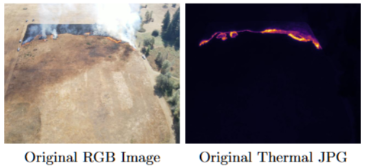
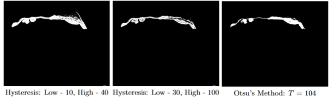
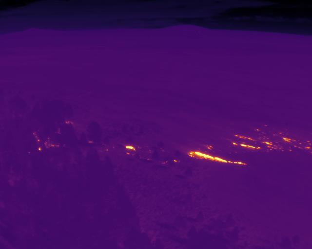
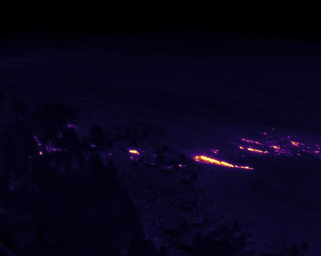
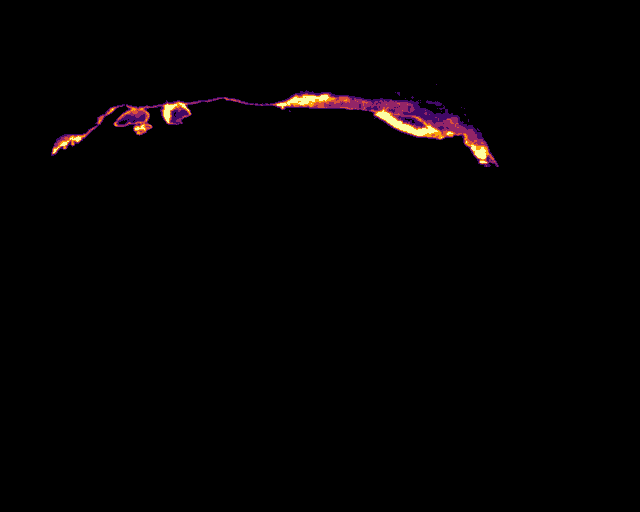

# FLAME 3 - Wildfire Thresholding Utilities

This repository contains utilities and Jupyter Notebook examples, which can be used for leveraging the radiometric TIFF data and Thermal JPG imagery included in the aerial (drone-collected) multispectral wildfire imagery dataset, [FLAME 3](https://ieee-dataport.org/open-access/flame-3-radiometric-thermal-uav-imagery-wildfire-management), based on the [FLAME 3 Paper](https://arxiv.org/abs/2412.02831). The tools found in this repository allow for applying thresholding techniques to TIFF files, applying a standard temperature calibration template, multi-class labeling based on TIFF temperature data, and other useful utilities for handling the radiometric data.

There are three Jupyter Notebooks included with examples, and they cover the following:
- `ThresholdingUtilsUsage.ipynb`
  - Showcases different thresholding techniques (binary, hysteresis, and Otsu's Method), applied to an indiviudal image or an entire folder of images.
- `TIFFCalibration.ipynb`
  - Showcases TIFF calibration (needed due to saturation of thermal cameras during data collection), recreation and copy of EXIF metadata of thermal JPGs, and a side-by-side visualization of the before and after.
- `TIFFLabelingUsage.ipynb`
  - Showcases the TIFF Labeling tools for multi-class labeling based on temperature data and colorizing for easy visualization.

These tools were developed by [Michael Marinaccio](https://github.com/mnmarinaccio) and used for work from the [SAM-TIFF Paper](https://arxiv.org/abs/2505.01638). The implementation for SAM-TIFF is found [here](https://arxiv.org/abs/2505.01638).

  

  

<table align="center">
  <tr>
    <td style="text-align:center;">
      <figure>
        
        <figcaption><strong>Uncalibrated Thermal JPG</strong></figcaption>
      </figure>
    </td>
    <td style="text-align:center;">
      <figure>
        
        <figcaption><strong>Calibrated Thermal JPG</strong></figcaption>
      </figure>
    </td>
  </tr>
</table>

  
  
<strong>Multi-Class Labeled TIFF (Colormap Visualization)</strong>

---

## Table of Contents
- [FLAME 3 - Wildfire Thresholding Utilities](#flame-3---wildfire-thresholding-utilities)
  - [Table of Contents](#table-of-contents)
  - [Documentation](#documentation)
  - [Requirements](#requirements)
  - [Installation](#installation)
  - [Usage](#usage)
  - [License](#license)

---

## Documentation
Please refer to the documentation, found [here](/Documentation.md), for any syntax or code-related questions.

## Requirements
- matplotlib==3.7.5
- numpy==1.24.4
- Pillow==10.4.0
- scipy==1.10.0
- scikit-image==0.21.0
- torch==2.4.1
- torchvision==0.19.1

## Installation
git clone https://github.com/mnmarinaccio/FLAME3_ThresholdingUtils.git  
cd ThresholdingUtils

You can install the dependencies with:  
pip install -r requirements.txt

## Usage
For the examples, open the notebook in Jupyter and run all cells  
jupyter notebook ThresholdingUtilsUsage.ipynb

For using the FLAME 3 Thresholding Utilities package, please import from the utils folder.

from utils.OtsuUtils import *  
from utils.ThresholdingUtils import *  
from utils.TIFF_Utilities import *  

## License
This project is licensed under the Apache 2.0 License. See the LICENSE file for details.

If you use these tools in your project, please cite this repository and the paper the tools were made for

@misc{marinaccio2025seeing,
    title={Seeing Heat with Color -- RGB-Only Wildfire Temperature Inference from SAM-Guided Multimodal Distillation using Radiometric Ground Truth},
    author={Michael Marinaccio and Fatemeh Afghah},
    year={2025},
    eprint={2505.01638},
    archivePrefix={arXiv},
    primaryClass={eess.IV}
}
